<div align="center">

# SkillWarden

**Scan, lock, and gate your Agent Skills — `npm audit` + lockfile + CI drift gate for the `SKILL.md` era.**

[](https://github.com/wookat/skillwarden/actions)
[](LICENSE)
[](https://www.npmjs.com/package/skillwarden)
[](package.json)

Sister project of [AgentGate](https://github.com/wookat/agentgate) (the same loop for MCP servers).

</div>

---

Agent Skills (`SKILL.md`) are executable context: they are injected into your agent's
session, steer its behavior, and often ship scripts the agent runs with your full
privileges. Thousands are published daily across Claude Code, Codex, Gemini CLI,
Cursor, OpenClaw, and 30+ other products — and installing one is `git clone` plus a
copy. SkillWarden is the security gate for that supply chain:

| Step | What it does |
|---|---|
| **Scan** | Deterministic, offline analysis of skills: prompt injection & instruction overrides, hidden Unicode (zero-width, bidi, tag characters), dangerous commands, credential leaks, exfiltration vectors, obfuscated bundled scripts |
| **Lock** | Pin every file of every approved skill (per-file SHA-256) into `skillwarden.lock` — rug-pull defense |
| **Gate** | `skillwarden ci` fails CI on any drift from the approved baseline or on findings at your severity threshold |
| **Advise** | Cross-check against a public, structured [Agent Skills advisory database](advisories/) |

No account, no API key, no LLM, no network: results are reproducible and CI-friendly.

> **Naming note:** the npm packages are **`skillwarden`** / **`skillwarden-core`** and the
> installed command is **`skillwarden`**. SkillWarden (formerly developed under the working
> name "SkillGate") is not affiliated with skillgate.sh or the npm package `skillgate`,
> an unrelated cloud LLM-audit tool by another author.



## Quick start

```bash
npm install -g skillwarden    # or: npx skillwarden
```

Scan the skills in your project — `.claude/skills`, `.agents/skills`, `.codex/skills`,
`.gemini/skills`, `.opencode/skills`, `.cursor/skills`, and `skills/` are discovered
automatically:

```bash
skillwarden scan                          # auto-discover, terminal table
skillwarden scan path/to/skill            # a single skill (dir or SKILL.md)
skillwarden scan --format json            # machine-readable report
skillwarden scan --format sarif -o report.sarif   # GitHub code scanning
```

Try it on the bundled examples (in a clone of this repo):

```bash
skillwarden scan examples/skills/benign-skill      # exit 0, clean
skillwarden scan examples/skills/malicious-skill   # exit 1, 8 findings
```

Pin the skills you reviewed, then gate on drift:

```bash
skillwarden lock                 # write skillwarden.lock (per-file SHA-256)
skillwarden diff                 # exit 1 + readable diff if any skill content changed
skillwarden ci --fail-on high    # CI gate: drift OR high-severity findings → non-zero exit
```

Exit codes: `0` clean, `1` gate failure (drift / findings at `--fail-on`), `2` usage or
environment error — see [docs/spec/cli-contract.md](docs/spec/cli-contract.md).

## CI gate in one step

```yaml
# .github/workflows/skillwarden.yml
steps:
  - uses: actions/checkout@v4
  - uses: wookat/skillwarden/packages/action@main
    with:
      fail-on: high
```

See [packages/action](packages/action/README.md) for all inputs.

## Scan rules

Six deterministic rule categories, aligned with real-world skills-ecosystem threats:

| Rule | Catches |
|---|---|
| `prompt-injection` | "ignore previous instructions", concealment ("don't tell the user"), jailbreak roleplay, fake system markers, precedence claims |
| `hidden-unicode` | zero-width characters, bidi controls, Unicode tag block (invisible instruction smuggling), private-use areas |
| `dangerous-commands` | `curl \| bash`, `rm -rf /`, reverse shells, disk-destructive commands, history tampering, persistence via cron/systemd |
| `credential-leak` | hardcoded AWS/GitHub/npm/OpenAI/Anthropic/Slack/Google tokens, private keys, JWTs (reported redacted) |
| `exfiltration` | env secrets in network requests, key-material reads (`~/.ssh`, `~/.aws`), dead-drop endpoints (webhook.site & co), ephemeral tunnels |
| `dangerous-scripts` | eval/exec of decoded payloads, download-then-execute chains, large base64/hex blobs, command injection in bundled scripts |

## Lockfile

`skillwarden.lock` (spec: [docs/spec/lockfile-v1.md](docs/spec/lockfile-v1.md)) records
every file of every skill with its SHA-256 plus an aggregate digest per skill. A skill
that changes upstream after you approved it — the classic registry rug-pull — turns CI
red with a per-file diff instead of silently reprogramming your agent.

## Threat model

Why skills are a distinct supply-chain problem, the attack chains observed in the wild
(ClawHavoc, ToxicSkills, the `openclaw-core` prerequisite trap), how they map onto the six
rule categories above, and — explicitly — the residual risks the rules do *not* cover:
[docs/THREAT-MODEL.md](docs/THREAT-MODEL.md). Confirmed incidents with named skills are in
the [advisory database](advisories/).

## How it compares

The quality linters (skill-tools, skill-check, skillmds) validate structure and score
quality; the security scanners (Snyk Agent Scan, skillgate.sh) need cloud accounts or
LLM APIs. Nobody else does content locking or drift gating for skills. Full,
source-verified matrix: [docs/COMPARISON.md](docs/COMPARISON.md).

## Contributing & security

Issues and PRs welcome. To report a vulnerability in SkillWarden itself, open a private
security advisory on GitHub. Advisory submissions: see [advisories/README.md](advisories/README.md).

Apache-2.0 © SkillWarden contributors.
